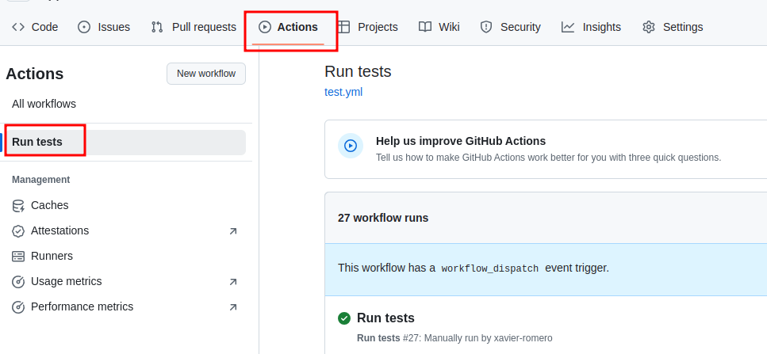
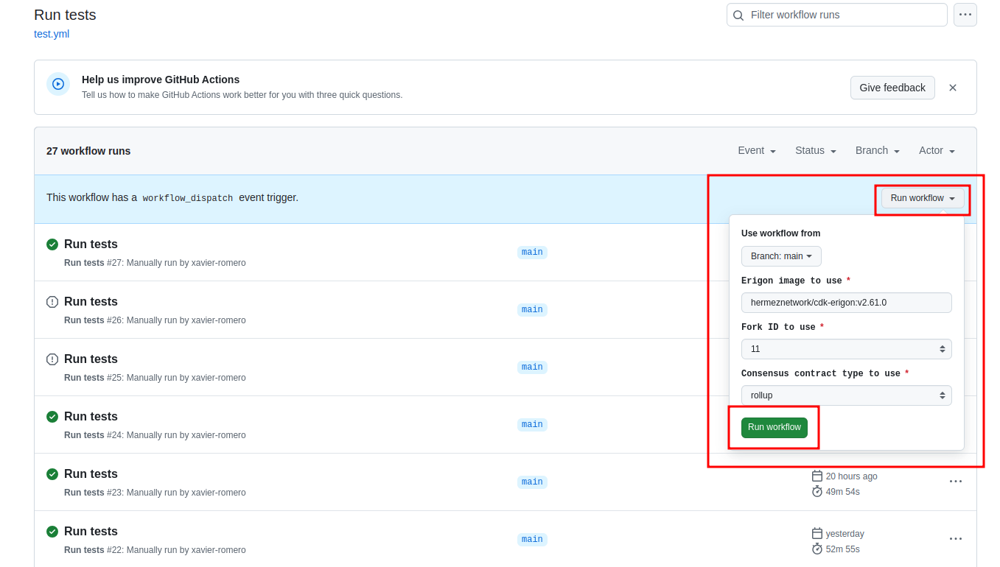
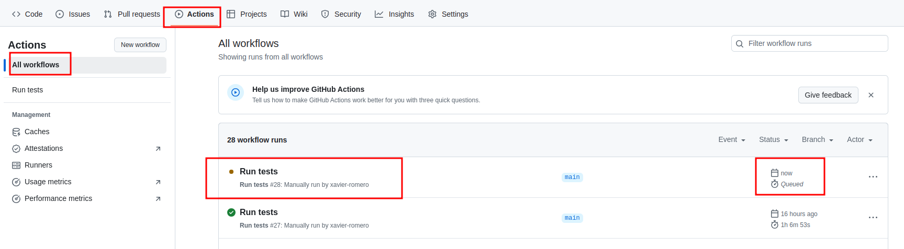
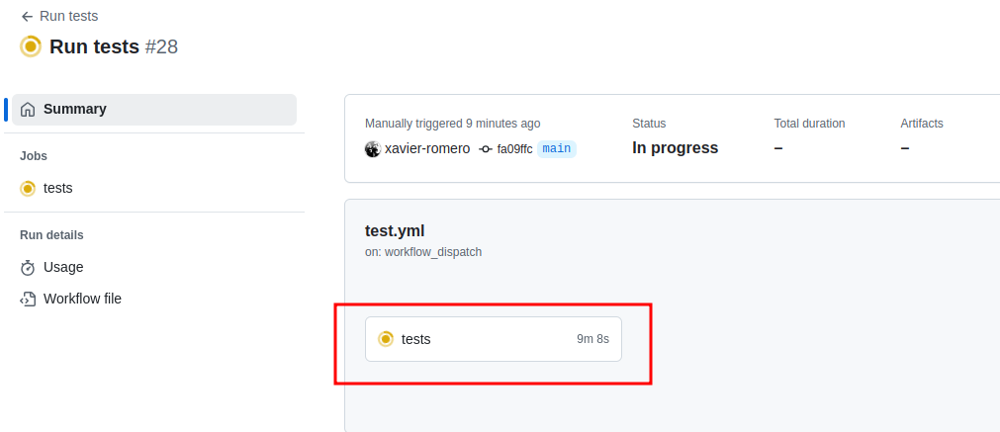
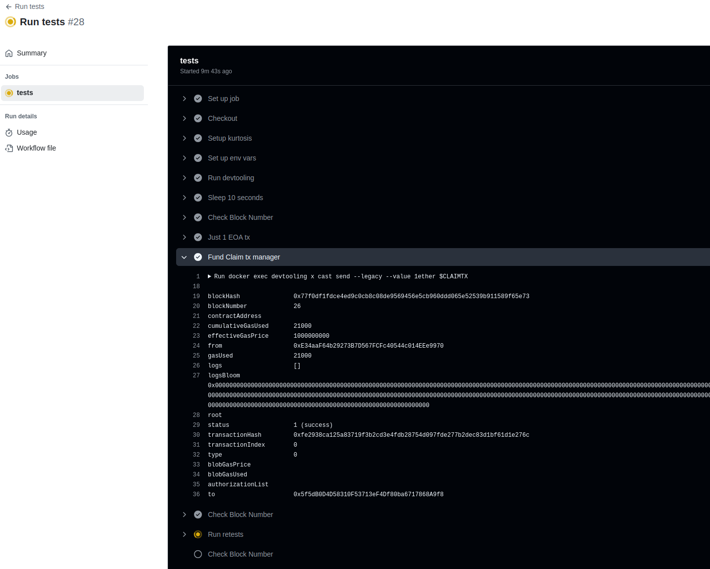

# Run tests for CDK-Erigon
## Triggering tests
Navigate to [repo actions page](https://github.com/xavier-romero/devtooling/actions/workflows/test.yml) and click on *Run tests* on the left pane:

Then, on the right side of the central pane, click on *Run workflow* and just:
- Set the Erigon image to use.
- Choose the forkid
- Choose the consensus contract
- Click on the green *Run workflow* button

## Check tests output
On the  [main workflow page](https://github.com/xavier-romero/devtooling/actions) you can list all the runs, and click on any of them to get the full logs of execution.
The run you just launched now, will be at the top of the list in *Queued* or *In progress* state.

List of tests:

Summary for your test:

Full output and timing for each executed step:

